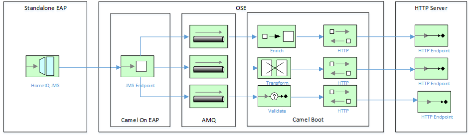

HornetQ -> AMQ -> HTTP using OpenShift Enterprise and Camel Boot
=======================================

This project demonstrates consumption of JMS messages from HornetQ, persiting them to A-MQ then forwarding them over HTTP to an Endpoint.

The Camel routes used in this example are explained by the following diagram:

Setup
==============================

Please follow the installation / setup instructions [here](ose-install/readme.md).

Getting Help
============================

If you hit any problems please let the Fuse team know on the forums
  [https://community.jboss.org/en/jbossfuse]

